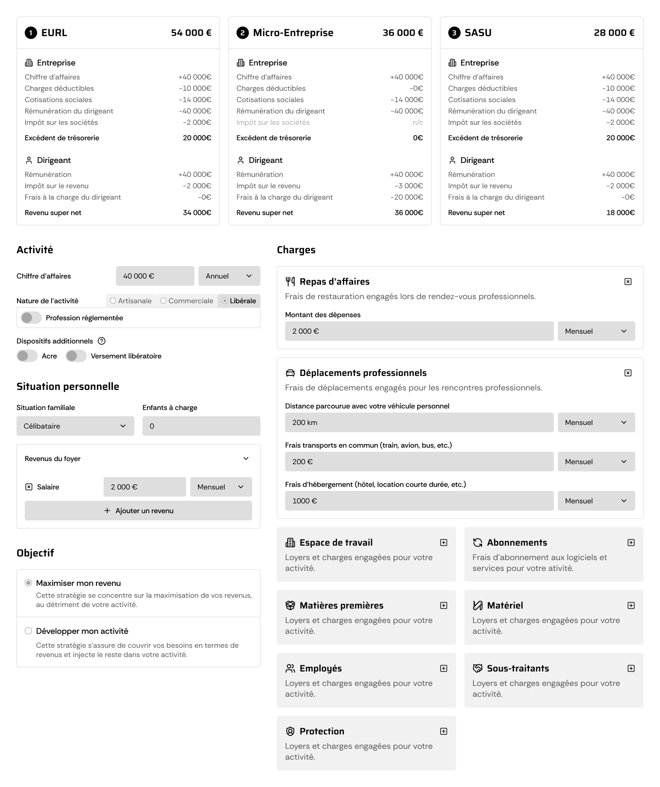
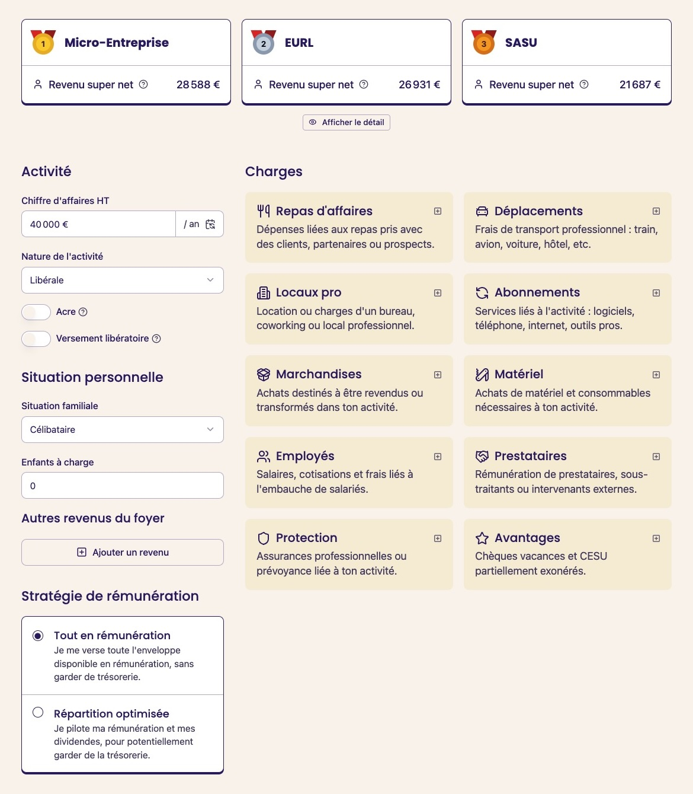

Quand je suis tombé sur la chaîne YouTube de **Swapn**, j'ai tout de suite accroché.

Grégoire, cofondateur du service de création d'entreprise en ligne, y partage l’envers du décor d’entreprises qu’on connaît tous. Sans jargon et avec du rythme.

Je m’y suis tout de suite retrouvé.

On a la même vision : **éduquer pour vendre, sans vendre**. Aider les indépendants à mieux comprendre leur environnement, pour faire de meilleurs choix.

Alors je contacte Grégoire pour lui proposer de contribuer à leur développement.

<!-- truncate -->

## Premier échange : aligner la stratégie

Ce premier rendez-vous, c’est l’occasion de faire connaissance et de parler stratégie.

Quels sont leurs objectifs ? Qu’est-ce qui pousse un visiteur à devenir client ? Et quels sont les moments où il a besoin d’aide pour se décider ?

On identifie vite **une question centrale dans le parcours d’un indépendant** :

> Quel statut juridique choisir ?

C’est une question qui revient sans cesse, déclencheur de prise de contact.

Mais Grégoire est très clair sur un point : il ne veut pas pousser la création une société sans raison. C'est **ni souhaitable pour tous, ni bon pour l’image de Swapn**.

On est alignés.

## Deuxième étape : cadrer le contenu

Pour la deuxième réunion, j’arrive avec une **liste complète des statuts à comparer** et des **avantages à créer une société**.

Je connais bien le sujet, donc on avance vite :

- On écarte les statuts trop rares ou inutiles ici,
- On élimine les "avantages" qui pourraient induire en erreur,
- Et on garde **ce qui parle vraiment aux indépendants**.

Je repars avec une liste claire, sous forme de bullet points, comme :

> - Arbitrage de la rémunération
> - Chèques vacances
> - CESU
> - Charges déductibles
>   - Repas d’affaires
>   - Frais de déplacement  
>     etc...

Pas besoin de longs briefs ou d’aller-retours : **je comprends la logique métier, je l’ai déjà intégrée dans d’autres simulateurs**. On peut aller à l’essentiel.

## Troisième étape : penser l’expérience utilisateur

On reste sur le fond, mais cette fois avec une **maquette basse fidélité**.

L’idée, c’est de valider :

- La structure,
- La lisibilité,
- L’accessibilité des comparaisons,
- Et l’adéquation avec les objectifs de Swapn.

Je pars du principe que le simulateur va devenir une **ressource de référence**. Donc je l’optimise pour un usage répété : tout est simple d’accès, rapide, lisible.

Et surtout : **je parle le langage des indépendants**.

Même pour évoquer des sujets juridiques, fiscaux ou sociaux, je reformule avec les mots d’un utilisateur. Et je joue sur plusieurs niveaux de lecture pour alléger l’interface.

Voici ce que je présente à Grégoire à cette étape :

:::note

Ce simulateur existe aussi dans des versions plus légères, adaptées à une consultation rapide. J’en parlerai dans une prochaine étude de cas.

:::

## Quatrième étape : développement

Une fois la maquette validée, je passe au développement.

Tout est géré de bout en bout :

- **Intégration graphique** à partir du site Swapn, sans solliciter leur équipe,
- **Fonctionnalités robustes**, testées en profondeur,
- **Améliorations UX** sur les zones sensibles (lisibilité, clarté, navigation),
- **Mise en ligne**, retour à Grégoire, derniers ajustements.

Et bien sûr, j’assure toute la partie technique :

- Hébergement,
- Suivi,
- Maintenance,
- Mises à jour.

Swapn n’a **rien à faire** côté technique et ils peuvent se concentrer sur le marketing.

Voici la version finale, en ligne aujourd’hui :

## Ensuite : intégration et suivi

Le simulateur n'est pas qu'un simple accessoire, il s'intègre à une vraie stratégie. Et c’est dans cette logique que je poursuis la collaboration avec Swapn.

On travaille ensemble sur :

- La **capture de leads**, via un affichage conditionné à l’adresse email,
- L’**intégration fluide** sur leur site, leurs blogs, leurs pages de vente,
- L’**optimisation SEO** avec leur équipe, pour maximiser la visibilité organique.

Et ça commence déjà à porter ses fruits : certaines pages issues du simulateur sont remontées en **première page sur Google**.

De quoi annoncer de très belles choses pour la suite 🤫

## Ce que cette étude de cas montre

Ce projet avec Swapn illustre mon processus de création d'un simulateur client et résume bien ma manière de travailler : **autonome, structuré, orienté impact**.

Grâce à ma maîtrise du métier et de la technique, on va droit au but : pas besoin d’explications interminables, ni de mobilisation massive côté client. Tout est pensé pour avancer vite, efficacement, et avec le bon niveau d’exigence.

Le résultat : un simulateur clair, utile, bien intégré à leur stratégie.

- [Simulateur de statut juridique Swapn](https://www.swapn.fr/simulateurs/simulateur-de-statut-juridique-en-ligne)
